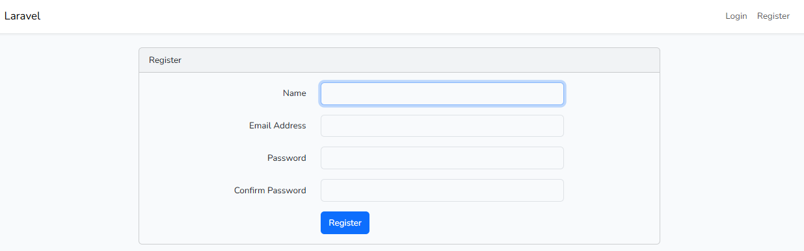

<p align="center"><a href="https://laravel.com" target="_blank"></a></p>

<p align="center">
<a href="https://github.com/laravel/framework/actions"></a>
<a href="https://packagist.org/packages/laravel/framework"></a>
<a href="https://packagist.org/packages/laravel/framework"></a>
<a href="https://packagist.org/packages/laravel/framework"></a>
</p>

# Universidad Tecnológica de Panamá

# Facultad de Ingeniería de Sistemas Computacionales

## Fecha de Ejecución:

15 de Abril de 2026

## Objetivos

• Comprender la importancia de la documentación en proyectos de desarrollo de software. 

• Consolidar el aprendizaje de la arquitectura Modelo-Vista-Controlador (MVC) en Laravel. 

• Evidenciar el proceso de configuración e implementación del módulo de login en Laravel. 

• Identificar las dificultades encontradas durante el laboratorio y las soluciones aplicadas. 

## Introducción

Laravel es un framework de desarrollo web basado en PHP que facilita la creación de aplicaciones modernas, seguras y escalables. Este framework utiliza el patrón de arquitectura Modelo-Vista-Controlador (MVC), el cual permite separar las responsabilidades del sistema en diferentes componentes, mejorando la organización del código.

En este laboratorio se desarrolló un sistema de autenticación (login y registro) utilizando el framework Laravel. El objetivo principal fue aplicar el patrón de arquitectura Modelo-Vista-Controlador (MVC), el cual permite organizar el código de manera estructurada y eficiente.

Durante el desarrollo del laboratorio, se configuró el entorno de trabajo, se instalaron las dependencias necesarias y se implementó el sistema de autenticación para permitir el registro e inicio de sesión de usuarios.

## ⚙️ Requisitos Previos

Para la ejecución del laboratorio se requiere contar con el siguiente ecosistema de desarrollo:

### Tecnologías utilizadas

- 🐘 PHP 8.0 o superior  
- 📦 Composer (última versión estable)  
- ⚙️ Laravel (framework PHP)  
- 🌐 Servidor web: Apache   
- 🛢️ Base de datos MySQL  
- 💻 Entorno de desarrollo local: XAMPP / WampServer 
- 📝 Editor de código: Visual Studio Code  
- 🟢 Node.js y NPM (para manejo de dependencias frontend)  

### 🖥️ Sistema Operativo

- Windows 10 / 11  

## 🔧 Instalación y configuración del proyecto

A continuación, se describe el proceso completo para instalar y ejecutar el proyecto Laravel desde cero. Estos pasos permiten que cualquier usuario pueda clonar el repositorio y poner en funcionamiento la aplicación correctamente.

---

### 1. Clonar o crear el proyecto

Si el proyecto ya está en un repositorio, se debe clonar:

```bash
git clone URL_DEL_REPOSITORIO
cd login-app
```

Si se crea desde cero:

```bash
laravel new login-app
```

---

### 2. Instalación de dependencias (Composer)

```bash
composer install
```

Este comando instala todas las dependencias del proyecto definidas en el archivo `composer.json`.
Las librerías se descargan en la carpeta `vendor/`, necesaria para el funcionamiento del sistema.

---

### 3. Configuración del archivo `.env`

Laravel utiliza un archivo `.env` para manejar variables de entorno.

Primero, se debe crear copiando el archivo de ejemplo:

```bash
cp .env.example .env
```

Luego se configura la base de datos:

```env
DB_DATABASE=login_db
DB_USERNAME=root
DB_PASSWORD=
```

Este paso es fundamental, ya que permite la conexión entre Laravel y la base de datos.

---

### 4. Generación de la clave de la aplicación

```bash
php artisan key:generate
```

Este comando genera una clave única (`APP_KEY`) necesaria para la seguridad de la aplicación, como la encriptación de datos y manejo de sesiones.

---

### 5. Ejecución de migraciones

```bash
php artisan migrate
```

Las migraciones crean automáticamente las tablas en la base de datos (usuarios, contraseñas, etc.).
Laravel registra cuáles migraciones ya fueron ejecutadas para evitar duplicados.

---

### 6. Limpieza de configuración (opcional pero recomendado)

```bash
php artisan config:clear
php artisan config:cache
```

Se utiliza para asegurar que los cambios realizados en el archivo `.env` sean reconocidos por el sistema.

---

## Implementación del sistema de autenticación

Para agregar el login y registro se utilizó Laravel UI:

```bash
composer require laravel/ui
php artisan ui bootstrap --auth
```

Este proceso genera automáticamente:

* Formularios de login
* Registro de usuarios
* Recuperación de contraseña

---

### 7. Instalación de dependencias frontend

```bash
npm install
npm run dev
```

Estos comandos instalan y compilan los archivos necesarios para la interfaz (CSS y JavaScript).
Si este paso no se ejecuta, la aplicación puede mostrar errores visuales.

---

### 8. Ejecución del servidor

```bash
php artisan serve
```

Finalmente, se inicia el servidor de desarrollo.

La aplicación estará disponible en:

http://127.0.0.1:8000/


## 🏗️ Arquitectura MVC en Laravel

Laravel utiliza el patrón de arquitectura Modelo-Vista-Controlador (MVC), el cual permite organizar el código separando responsabilidades y facilitando el mantenimiento de la aplicación.

A continuación, se describen las principales carpetas utilizadas en este laboratorio:

### 📁 Modelos (Models)

Se encuentran en la carpeta app/Models.
Son los encargados de manejar la lógica de datos y la interacción con la base de datos.
Cada modelo representa una tabla en la base de datos.

### 🎨 Vistas (Views)

Se ubican en la carpeta resources/views.
Son las encargadas de mostrar la información al usuario mediante interfaces gráficas, generalmente utilizando archivos Blade (.blade.php).

### 🧠 Controladores (Controllers)

Se encuentran en app/Http/Controllers.
Gestionan la lógica de la aplicación, conectando los modelos con las vistas.

### 🔗 Rutas (Routes)

Se definen en el archivo routes/web.php.
Permiten definir las URL del sistema y conectar las solicitudes del usuario con los controladores.

## 🔄 Migraciones

Las migraciones permiten crear y modificar la estructura de la base de datos de forma automática.

Durante el laboratorio se utilizaron los siguientes comandos:

```bash
php artisan migrate
```

Este comando ejecuta todas las migraciones pendientes y crea las tablas necesarias en la base de datos, como la tabla de usuarios.

En caso de ser necesario reiniciar la base de datos, se puede utilizar:

```bash
php artisan migrate:fresh
```

Este comando elimina todas las tablas y las vuelve a crear desde cero.

## 🎯 Objetivo del laboratorio

Implementar un sistema de autenticación (registro e inicio de sesión) utilizando Laravel, aplicando el patrón de arquitectura MVC, con el fin de comprender la estructura del framework y su funcionamiento en aplicaciones web modernas.

## 🖼️ Resultado

A continuación se muestra la interfaz del sistema de autenticación implementado:



## 🗄️ Base de Datos

Para el desarrollo del laboratorio se utilizó el sistema de gestión de base de datos MySQL, el cual permitió almacenar la información de los usuarios registrados en el sistema de autenticación.

### 🛠️ Comandos utilizados

Durante el laboratorio se utilizaron los siguientes comandos relacionados con la base de datos:

php artisan migrate

php artisan migrate:fresh

php artisan config:clear

Estos comandos permitieron crear, actualizar y asegurar el correcto funcionamiento de la base de datos.

### 💾 Respaldo de la Base de Datos

Se realizó un respaldo (backup) de la base de datos utilizando phpMyAdmin, exportando la base de datos en formato .sql.

Este archivo de respaldo se incluye dentro del repositorio del proyecto, permitiendo restaurar la base de datos en caso de ser necesario.

Nombre del Archivo: example_app.sql

## ⚠️ Dificultades y Soluciones

Durante el desarrollo del laboratorio se presentaron algunos problemas comunes, los cuales fueron solucionados de la siguiente manera:

### Error: Vite manifest not found

Al ejecutar el proyecto, se presentó un error indicando que no se encontraba el archivo manifest.json.

Solución:

Se instalaron y compilaron las dependencias frontend con:

```bash
npm install
```

```bash
npm run dev
```

### Error: Dependencias no instaladas

El proyecto no funcionaba correctamente debido a que no se habían instalado las dependencias necesarias.

Solución:

```bash
composer install
```

Esto permitió instalar todas las librerías requeridas por Laravel.

## 📚 Referencias

A continuación, algunas de las fuentes consultadas para el desarrollo del laboratorio:

Laravel. (2026). Documentación oficial de Laravel. https://laravel.com/docs

Stack Overflow. (2026). Preguntas y respuestas sobre errores comunes en Laravel. https://stackoverflow.com

Laravel - Validation. (s. f.). https://www.tutorialspoint.com/laravel/laravel_validation.htm

## 👤 Información del Estudiante

Este laboratorio ha sido desarrollado por el estudiante de la Universidad Tecnológica de Panamá:

Nombre: Carlos Concepción

Correo: carlos.concepcion2@utp.ac.pa

Curso: Desarrollo de Software VII

Instructor: Irina Fong


